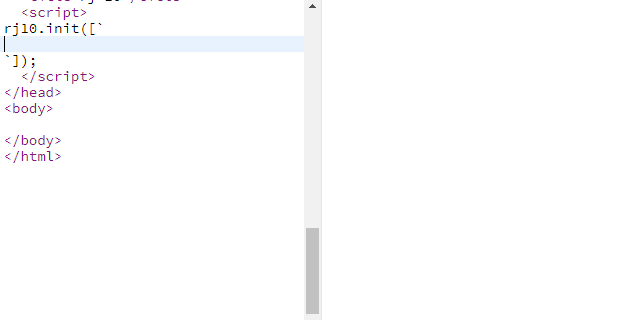

# rj-10 ([Demo](https://abagames.github.io/rj-10/index.html))

Text tilemap based game development environment.




## How to make

Play [tutorial](https://abagames.github.io/rj-10/tutorial.html) to know basic rules.

### Sample code

See the [tutorial code](src/demo/tutorial.ts) or the [demo code](src/demo/main.ts) as an example code.

### Tilemap

```
###########   \
#         #   -- These lines represent a text tilemap
# @     o #   /
  c     y     <- This line sets a color of text in the previous line
#         #   \
###########   -- These lines also represent a text tilemap
```

### Rules

- Colored text becomes an actor (game object).
- `c`yan and `b`lue actors are players, `r`ed and `p`urple actors are enemies, `y`ellow and `g`reen actors are goals and gr`a`y actors are walls.
- To win the level, the player must reach all goals, or survive 10 secondes when no goal exists in the level.
- Specific characters in the actor define a behavior of the actor.
- `@` character moves with the arrow or wasd keys.
- `^Z>nvz<N` character moves forward and reflects with `-|/\`.
- `RL` character turns to right/left along the wall.
- `F` character fires the neighboring actor periodically.
- Same color text is treated as a single actor.
- The behavior of character neighboring `sf` becomes slow/fast.

### Playground

Use [this jsbin](https://jsbin.com/mejupig/edit?html,output) to write a game on a browser.

## Acknowledgement

rj-10 is inspired by [Pix64](https://zappedcow.itch.io/pix64)
